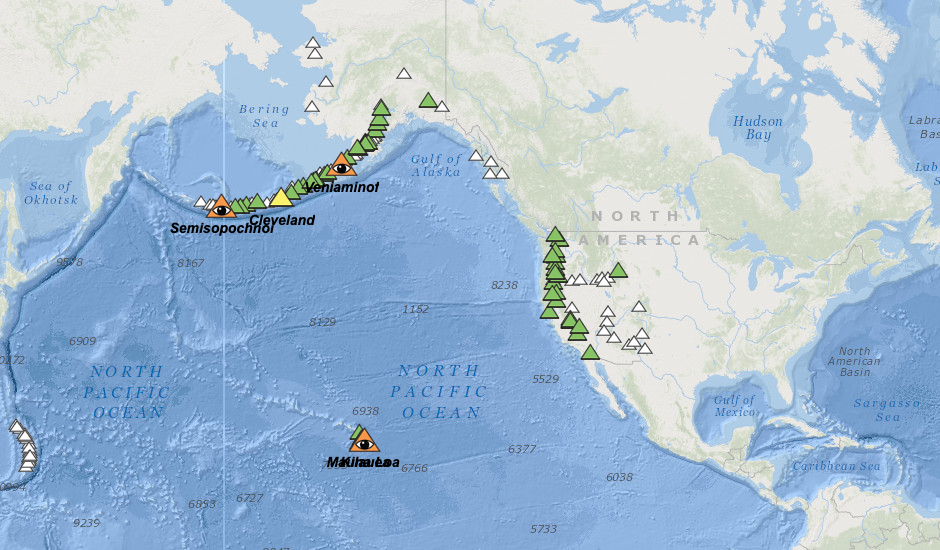

<h2>Project 2 Team:</h2>
<ul><li>Dan Freda</li>
  <li>Banu Nathan</li>
  <li>Fleming Brathwaite</li>
  <li>Shawntell Manning</li></ul>

<h2>Project Description:</h2>
<ol><li>Your task is to tell a story using data visualizations.</li>
<li>Focus on providing users an interactive means to explore data themselves.</li>
<li>Prepare a 10-minute presentation that lays out your theme, coding approach, data munging techniques, and final visualization.</li>
<li>You may choose a project of any theme, but we encourage you to think broadly.</li>
<li>You will have ample time in class to work with your group, but expect to put in hours outside of class as well.</li></ol>

<h2>Project Requirements:</h2>
<ol><li>Your visualization must include a Python Flask–powered API, HTML/CSS, JavaScript, and at least one database (SQL, MongoDB, SQLite, etc.).</li>
<li>Your project should fall into one of the below four tracks: 
<ul><li>A custom “creative” D3.js project (i.e., a nonstandard graph or chart)</li>
<li>A combination of web scraping and Leaflet or Plotly</li>
<li>A dashboard page with multiple charts that update from the same data</li>
<li>A “thick” server that performs multiple manipulations on data in a database prior to visualization (must be approved)</li></ul></li>
<li>project should include at least one JS library that we did not cover.</li>
<li>project must be powered by a data set with at least 100 records.</li>
<li>project must include some level of user-driven interaction (e.g., menus, dropdowns, textboxes).</li>
<li>Your final visualization should ideally include at least three views.</li></ol>

<h2>Project Proposal:</h2>

Our project will involve creating a visualization of volcanic activity worldwide.

In light of the current volcanic eruption of Saint Soufrere which took place in Saint Vincent and Grenadines, our group chose to focus our project on bringing awereness to the scope of volcanic activities in an interactive and geographic visualization. We also beleive this is a great opportunity to study how scientists can view trends in natural phenomena to make predictions to proactively save lives.
 

We plan to construct a global view of volcanic references which are labeled according to their current status of activity. For example: <ul>
<li>Green = normal</li>
<li>Yellow = advisory</li>
<li>Orange = watch</li>
<li>Red = warning</li></ul>

A more detailed breakdown of these categorical levels can be found on the USGS site: <a href="https://www.usgs.gov/volcano/alert-level-icons">https://www.usgs.gov/volcano/alert-level-icons</a>

We found the following visualization best displays our intended goal:

You can explore the interactive verson on the following site: <a href="https://www.usgs.gov/natural-hazards/volcano-hazards/">https://www.usgs.gov/natural-hazards/volcano-hazards/</a>

<h2>Data Sources:</h2>

<ol><li><h3>Smithsonian Institution: Global Volcanism Program</h3>

Site: <a href="https://volcano.si.edu/search_volcano.cfm">https://volcano.si.edu/search_volcano.cfm</a>
  
File Type: <a href="Data/GVP_Volcano_List.xls">Excel</a>

"Volcanoes of the World" is a database describing the physical characteristics of Holocene volcanoes and their eruptions. This search returns a list which may be filtered based on a volcano name, volcano type, features, evidence of recent activity, location (set using a map), country, rock types, population within various distance ranges, or the availability of images. Name and country searches will also return subfeature names and synonyms; using other filters will result in only primary volcano names being returned. A standard set of fields is shown on the screen display, but full results with additional content may be downloaded into an Excel spreadsheet.
</li>

<li><h3>NOAA: Significant Volcanic Eruption Database</h3>

Site: <a href="https://public.opendatasoft.com/explore/dataset/significant-volcanic-eruption-database/information/">https://public.opendatasoft.com/explore/dataset/significant-volcanic-eruption-database/information/</a>

File Type: <a href="https://public.opendatasoft.com/api/records/1.0/search/?dataset=significant-volcanic-eruption-database&q=&facet=year&facet=tsu&facet=eq&facet=name&facet=location&facet=country&facet=type&facet=status&facet=deaths_description&facet=missing_description&facet=injuries_description&facet=damage_description&facet=houses_destroyed_description&facet=total_deaths_description&facet=total_missing_description&facet=total_injuries_description&facet=total_damage_description&facet=total_houses_destroyed_description&facet=houses_damaged_description">Json</a>

The Significant Volcanic Eruption Database is a global listing of over 500 significant eruptions which includes information on the latitude, longitude, elevation, type of volcano, and last known eruption. A significant eruption is classified as one that meets at least one of the following criteria: caused fatalities, caused moderate damage (approximately $1 million or more), with a Volcanic Explosivity Index (VEI) of 6 or larger, caused a tsunami, or was associated with a major earthquake.
</li></ol>
